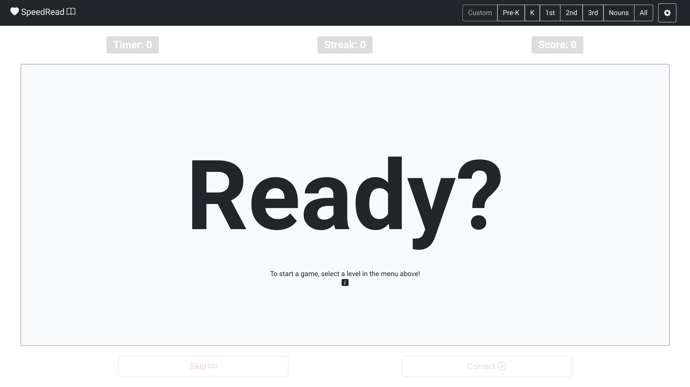

# SpeedRead
SpeedRead by Justin M. Wray

https://wrayjustin.github.io/SpeedRead/ | https://www.justinwray.com

All Rights Reserved

## About
SpeedRead is a web-based, gamified, sight word learning program.  SpeedRead is based on the "Dolch" Sight Word list and provides default words based on the target education level. 

### Features
 - Score Tracking & Modes (*See [Scoring Types](#scoring-types)*)
 - Detailed Statistics
     - Overall Scores, Speed, Streaks, etc.
     - Per-Word Accuracy, Speed, etc.
 - Sound Effects and Reading of Skipped Words
 - Game Saves / Resume / Merge (*See [Game Save Data](#game-save-data)*)
 - Default Word Lists, by Grade Level (*See [Word Lists](#word-lists)*)
 - Custom Word Lists (*See [Custom Wordlists](#custom-wordlists) | [Other Uses](#other-uses)*)
 - Customizable Settings (*See [Game Settings](#game-settings)*)
 - Multiple Themes/Visuals (*See [Game Settings](#game-themes)*)
 - Keyboard Shortcuts (*See [Keyboard Shortcuts](#keyboard-shortcuts)*)
 - Multi-Platform Support (*See [Requirments](#requirments)*)
 - Full Offline Support (*See [Requirments](#requirements)*)

## Details

### Word Lists
|Level| Words |
|--|--|
| Pre-K | a, and, away, big, blue, can, come, down, find, for, funny, go, help, here, I, in, is, it, jump, little, look, make, me, my, not, one, play, red, run, said, see, the, three, to, two, up, we, where, yellow, you |
| Kindergarten | all, am, are, at, ate, be, black, brown, but, came, did, do, eat, four, get, good, have, he, into, like, must, new, no, now, on, our, out, please, pretty, ran, ride, saw, say, she, so, soon, that, there, they, this, too, under, want, was |
| 1st Grade | after, again, an, any, as, ask, by, could, every, fly, from, give, going, had, has, her, him, his, how, just, know, let, live, may, of, old, once, open, over, put, round, some, stop, take, thank |
| 2nd Grade | always, around, because, been, before, best, both, buy, call, cold, does, don't, fast, first, five, found, gave, goes, green, its, made, many, off, or, pull, read, right, sing, sit, sleep, tell, their, these, those, upon, us, use, very, wash, which, why, wish, work, would, write, your |
| 3rd Grade | about, better, bring, carry, clean, cut, done, draw, drink, eight, fall, far, full, got, grow, hold, hot, hurt, if, keep, kind, laugh, light, long, much, myself, never, only, own, pick, seven, shall, show, six, small, start, ten, today, together, try, warm |
| Nouns | apple, baby, back, ball, bear, bed, bell, bird, birthday, boat, box, boy, bread, brother, cake, car, cat, chair, chicken, children, Christmas, coat, corn, cow, day, dog, doll, door, duck, egg, eye, farm, farmer, father, feet, fire, fish, floor, flower, game, garden, girl, goodbye, grass, ground, hand, head, hill, home, horse, house, kitty, leg, letter, man, men, milk, money, morning, mother, name, nest, night, paper, party, picture, pig, rabbit, rain, ring, robin, Santa Claus, school, seed, sheep, shoe, sister, snow, song, squirrel, stick, street, sun, table, thing, time, top, toy, tree, watch, water, way, wind, window, wood |
| All | *[Contains all of the pre-defined words.]*
| Custom | *[Allows for custom, user-defined words.]*

### Scoring Types
SpeedRead contains three scoring modes, providing different methods for incentivizing accurate and timely answers.  The "Game Score Type" can be changed at any time and will automatically update the relevant score displays.

#### Plus-Minus
One point is earned for every correct answer, and one point is lost for every skipped word. *[This is the default scoring mode.]*

#### Total Stars
The score is based on stars earned by speed, up to five stars per correct answer.  No score reductions for skipped words. *[Friendly Mode]*

#### Time-Based
Scoring is based on speed, with points added for correct answers and deducted for skipped words.  The points awarded, or subtracted, are based on the maximum number of seconds spent up to the time limit set. *[Competitive Mode]*

### Game Settings
SpeedRead allows for the customization of various game settings.  The following settings are customizable:
| Action | Key | Default |
|--|--|--|
| Game Score Type | Determines the Scoring Metric (*See [Scoring Types](#scoring-types)*) | `Plus-Minus` |
| Round Time Limit | Time before the word is skipped automatically.  Also used as the basis for time warnings. | `30` |
| Max Stars Per Round | Maximum amount of stars earned per round; used as the basis for stars awarded for a correct answer. | `5` |
| Custom Game Wordlist | (*See [Custom Wordlists](#custom-wordlists)*) | -- |
| Custom State Data | (*See [Game Save Data](#game-save-data)*) | -- |
| Game Theme | Visual themes for the interface (*See [Game Settings](#game-themes)*) | `light` |
| Advanced Settings | (*See [Game Save Data](#game-save-data)*) | -- |

Saved changes to these settings will take effect immediately and automatically update relevant statistics.

### Keyboard Shortcuts
To provide for quick and easy proctoring, the game supports keyboard shortcuts to navigate.  The supported keyboard shortcuts are as follows:
| Action | Key |
|--|--|
| Pause/Resume | *Space Bar* |
| Correct Answer | *Right Arrow* |
| Skip Word | *Left Arrow* |

### Game Save Data
Game Data can be saved from the "Game Settings" screen.  Save data is provided in both text form and a sharable URL.  The text version can be copied, stored, and then later pasted into the Save Data field to resume a game.  The URL is a link that automatically continues the game and can be shared.

Additionally, various game saves can be merged (combined) to create cumulative games.  Joining games can be useful for combining games when one was not resumed or building long-term statistics (across sessions).  Merging saves can be found under the "Advanced Settings" option of the "Game Settings" screen.

#### To Save
Copy and Store (in a file, etc.) the "Game State Data" content from the "Game Settings" dialog.  Alternatively, you can save the Game Data URL (right-click the link icon and select your browser's link-copy option).

#### To Resume
Paste previously saved data into the "Game State Data" field of the "Game Settings" screen, and click "Save."  Alternatively, click the previously saved Game Data URL (or paste it into your browser's address bar).

#### To Merge
Click and expand the "Advanced Settings" under, and enter one saved game (the desired "Game State Data") into "Game Save #1"  and the other into "Game Save #2."  You can only merge two games at a time, but you can run the operation multiple times.  Click "Merge Data."  The combined game will be loaded, and you can save the new data through the traditional methods.

### Requirements
SpeedRead is a single file that can be played (and stored) entirely offline.  However, it requires some third-party dependencies and an initial internet connection when first loaded.  Additionally, the browser must support ~2015-level features and functionality; use a new(ish) browser version for best results.

SpeedRead should support (and has limited testing on):
 - Google Chrome/Chromium (Version 49+)
 - Microsoft Edge (Version 12+)
 - Mozilla Firefox (Desktop Version  36+ / Mobile Version  49+)
 - Apple Safari (Desktop Version 10+ / iOS Version  10+)
 - Amazon Silk (Version 49+ | Fire Table, Fire TV, Echo Show)
 - Samsung Internet Browser (Version 49+)
 - Opera (Desktop Version 36+ / Mobile Version 64+ / All Mini Versions / Mobile 3+)
 - UCWeb UC Android (Version 11+)
 - Tencent QQ Browser (Version 10+)
 - Badiu Browser (Version 7+)
 - KaiOS Browser (Version 2+)

Third-Party Resources:
 - CDN (cdn.jsdelivr.net)
 - CSS (stackedit.io)

SpeedRead may work on older versions of the above or other alternative browsers (primarily if they are based on one of the above).  However, testing has not been conducted on other browsers.  Please submit an issue if compatibility issues are discovered.

SpeedRead has also been tested via "Casting" from mobile and desktop applications to TV screens, via Chrome Casting, AirPlay, etc.

### Custom Wordlists
SpeedRead allows for custom wordlists to be defined.  All wordlists must be comma separated and may only contain alphanumeric, hyphens, spaces, and apostrophes.

Updates to the custom wordlist are applied immediately upon the settings save.

### Game Themes
SpeedRead contains a few different visual themes.  The theme can be changed from the settings dialog and updated immediately.

#### Light (Default)
The default theme is a "Light" color mode, with minimal distractions.

#### Dark
A sane inversion of the default mode, the "Dark" mode provides light text on dark backgrounds with minimal distractions.

#### Chalkboard
Designed to mimic a school chalkboard setting, including "decorations" of an apple, eraser, and chalk.

#### Chalkboard Dark
A dark-mode version of the schoolhouse chalkboard design.

#### Prince
A blue-colored based theme.

#### Princess
A pink/purple-colored theme.

### Other Uses
Although SpeedRead was designed for those just learning to read English, and to study "Sight Words" in particular, the flexibility of Custom Wordlists allows for a wider range of usage.

SpeedRead requires a "proctor," but this *"limitation"* enables additional use cases for those who can already read.  In such a case, SpeedRead acts as a "flash card" application.  The content added to the word list can include text used by the learner to initiate some form of recall (memorization).

Additionally, SpeedRead can be useful, for any age, for learning a non-native language.  Such language learning can be useful for both reading and pronunciation.

Example Alternative Uses:
 - Memorizing/Reciting/Studying Data and Facts
     - Laws
     - Bible Verses
     - Technical Terms / Figures
 - Proctored Flash Cards / Studying
 - Non-Native Reading
 - Non-Native Pronunciation

*Note*: SpeedRead allows only alphanumeric (and hyphens, spaces, and apostrophes) entries in the wordlist - no special characters are allowed (excluding space). (*See [Custom Wordlists](#custom-wordlists)*)

## Development
SpeedRead is a prime example of a quick idea turning into a weekend project.  This project is also a great representation of "feature creep."  What started as a quick "app," in less than a few dozen lines of code, turned into a featured-filled game.  Feedback from players and proctors resulted in numerous features rapidly added over a weekend (game saves, different scoring modes, etc.).  As a result, although no bugs are currently known, the overall code quality is definitively "hacky."

The application is built using the following technologies:
 - HTML5
 - CSS3
 - Vanilla JavaScript (ES6)
 - Bootstrap (5.2)
 - Bootstrap Icons (1.9)
 - Bootstrap Dark (1.1)
 - DarkmodeJS (1.1)
 - LZString (1.4)
 - HTML2Canvas (1.4)

## License & Rights
You are free to play the game (including in a classroom setting).  You may store an unmodified copy for offline play.  All other rights are reserved.
